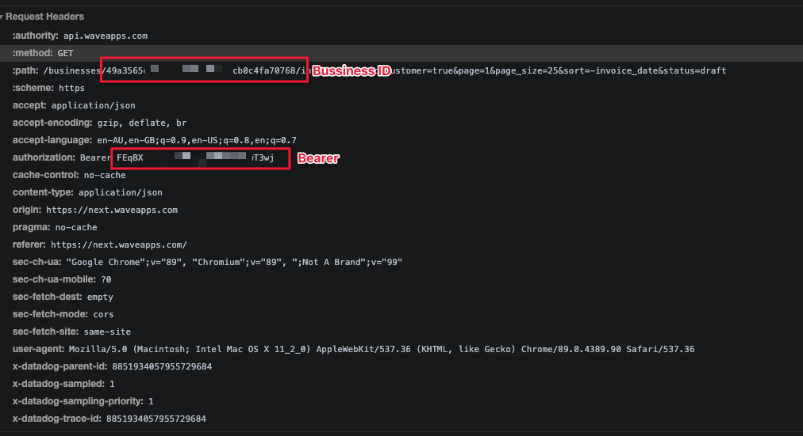

# Wave Invoice Exporter

Wave is shutting it doors to non USA customers soon (Jul 2021). This tool downloads both PDF and JSON (with relations) copies of your invoice data for archival purposes (tax, etc).

## How to use.

```bash
yarn install
node index.js
```

You will be prompted for two bits of info, your bearer token and your business URL. See the following screenshot for examples. The easiest way to get this is inspect the network requests and copy it out.





## Licence
MIT
